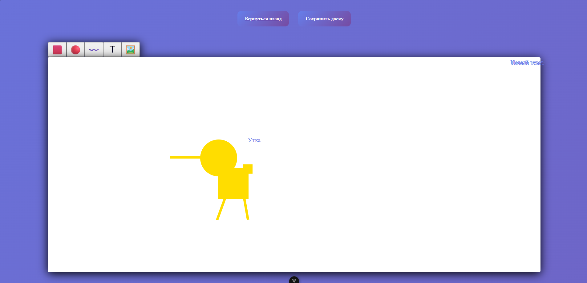

# 🖼️ WhiteBoard — Интерактивная доска

> Реализовано для участия в региональном этапе чемпионата **«Профессионалы» 2026**  
> Компетенция: **Веб-технологии**

Современное SPA-приложение для создания, редактирования интерактивных досок.  
Поддерживает работу с геометрическими фигурами, текстом, изображениями.



---

## ✨ Возможности

- ✅ Создание досок с уникальной публичной ссылкой (`/board/:hash`)
- ✅ Добавление объектов: **прямоугольник**, **круг**, **линия**, **текст**
- ✅ Перемещение, поворот (колёсиком мыши), изменение размера
- ✅ Сохранение состояния доски между сессиями
- ✅ Система лайков и сортировка по популярности
- ✅ Публичный доступ к доске — без авторизации
- ✅ Авторизация и регистрация (мок-режим)

---

## 🛠 Технологии

- **Frontend**: Vue 3 + Composition API
- **State Management**: Pinia
- **Routing**: Vue Router
- **Сборка**: Vite
- **Хранение**: localStorage (готово к замене на API)
- **Стили**: Чистый CSS, BEM

---

## 📦 Установка и запуск

1. Клонируйте репозиторий:
   ```bash
   git clone https://github.com/your-username/whiteboard.git
   cd whiteboard
   ```
2. Установите зависимости:
```
  npm install
```
3. Запустите dev режим
```
npm run dev
```
